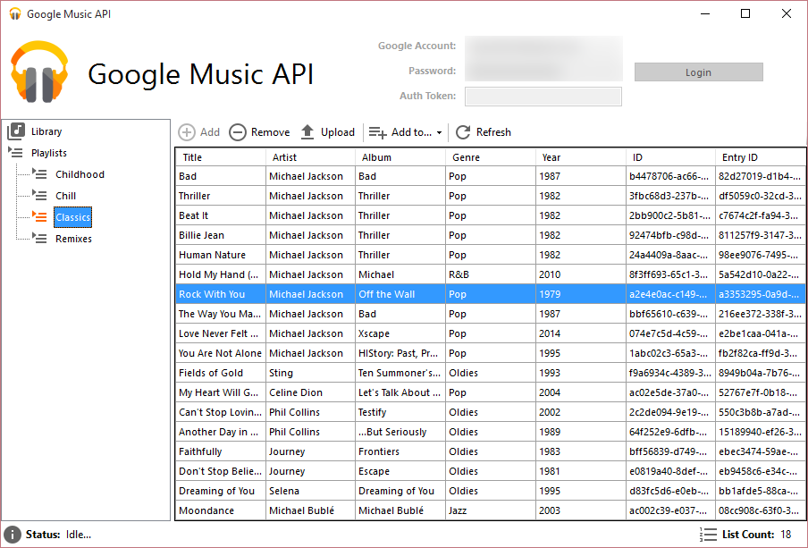

Google Music API (.NET Framework)
========================

An unofficial, full implementation of Google's Play Music API for the .NET Framework. This is still a work in progress.

This repository also includes a simple UI that demonstrates some of the core functionality of the API.

